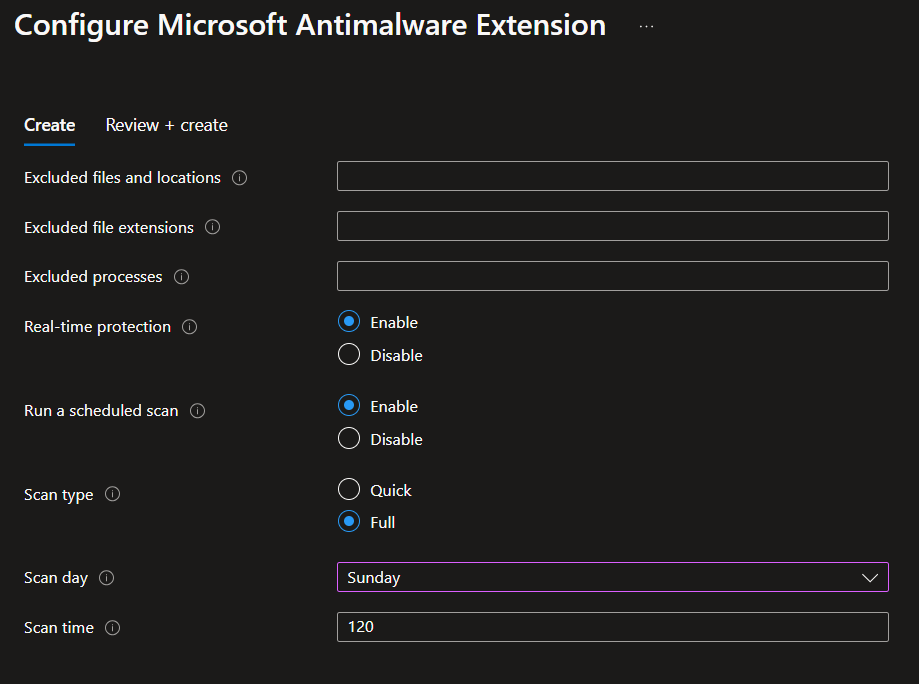

# Azure Defender for Cloud

Set of resources and configuration to apply Defender capabilities.

Create the baseline infrastructure:

```sh
cp config/sample.tfvars .auto.tfvars

terraform init
terraform apply -auto-approve
```

Make sure Defender is enabled.

> TODO: Document Log Analytics stuff

## Environment Settings

Add the desired subscriptions to the Defender scope.

### Cloud Security Posture Management (CSPM)

Enable [Defender CSPM][3] to make all features available.

### Cloud Workload Protection (CWP)

Enable the protection for:

- Servers
- Databases
- Key Vault

Or others to track even more resource types.

## Just-in-Time (JIT)

JIT is implemented in my dedicated repository: https://github.com/epomatti/az-vm-jit

## Server protection

Defender will use Microsoft Defender for Endpoint (MDE) for EDR, as well as [agentless][2] scanning based on the OS disk.

The AMA is [not required][1] for Defender but it is installed anyways in this VM.

### Billing

Check the differences between the [plans][7].

Deallocated/ing or starting servers are [not billed][8].

When you enable Defender for Servers you're charged for **_all_** connect machines based on the power state. You're also charged for on AWS.

## Interactive guides

Outlining Defender capabilities:

- Attack path analysis
- Hunting
- Posture
- Security governance (rules) - weekly email is sent to owners with the recommendations they're assigned to.
- Multi-cloud
- Visibility of vulnerabilities with agentless scanning
- Protect workloads with alerts correlation
- Malware Scanning
- Container threat detection and policy enforcement
- Protect your APIs

## Roles

There are two specific roles for Defender for Cloud:

- Security Administrator
- Security Reader

## Data collection for Servers

From the [docs][4]:

- Azure Monitor Agent (AMA)
- Microsoft Defender for Endpoint (MDE)
- Log Analytics agent
- Azure Policy Add-on for Kubernetes

How to [activate the agents][5].

## SQL 

### Alerts

Check the [Alerts for SQL Database and Azure Synapse Analytics][6] to identify threats for SQL.

For example, **SQL Injection** may have the following:

- Vulnerability: Faulty SQL statement or no sanitation.
- Potential: An active exploit has occurred against an identified application vulnerable to SQL injection.

## Workflow automation

Use Workflow automation to react when state changes in Defender.

Trigger conditions:

- Security alert
- Recommendation
- Regulatory compliance standards

A Logic App will be created so that it can be selected via the Portal.

## External Attack Surface Management (Defender EASM)

To create an EASM workspace, use the Portal.

## Anti-malware

Enable the anti-malware extension for the **vm-antimalware** resource, which is called `Microsoft Antimalware` in the gallery (with type `Microsoft.Azure.Security.IaaSAntimalware`).

Example running a Fulls Scan scheduled every Sunday 2AM.




[1]: https://learn.microsoft.com/en-us/azure/defender-for-cloud/auto-deploy-azure-monitoring-agent
[2]: https://learn.microsoft.com/en-us/azure/defender-for-cloud/concept-agentless-data-collection
[3]: https://learn.microsoft.com/en-us/azure/defender-for-cloud/concept-cloud-security-posture-management
[4]: https://learn.microsoft.com/en-us/training/modules/configure-integrate-analytics-agent-defender-cloud/2-set-security-event-option-workspace-level
[5]: https://microsoftlearning.github.io/Secure-Azure-services-and-workloads-with-Microsoft-Defender-for-Cloud-regulatory-compliance-controls/Instructions/Labs/LAB_04_Configure%20and%20integrate%20a%20Log%20Analytics%20agent%20and%20workspace%20in%20Defender%20for%20Cloud.html
[6]: https://learn.microsoft.com/en-us/azure/defender-for-cloud/alerts-reference#alerts-sql-db-and-warehouse
[7]: https://learn.microsoft.com/en-us/azure/defender-for-cloud/plan-defender-for-servers-select-plan
[8]: https://learn.microsoft.com/en-us/azure/defender-for-cloud/faq-defender-for-servers#what-servers-do-i-pay-for-in-a-subscription-
